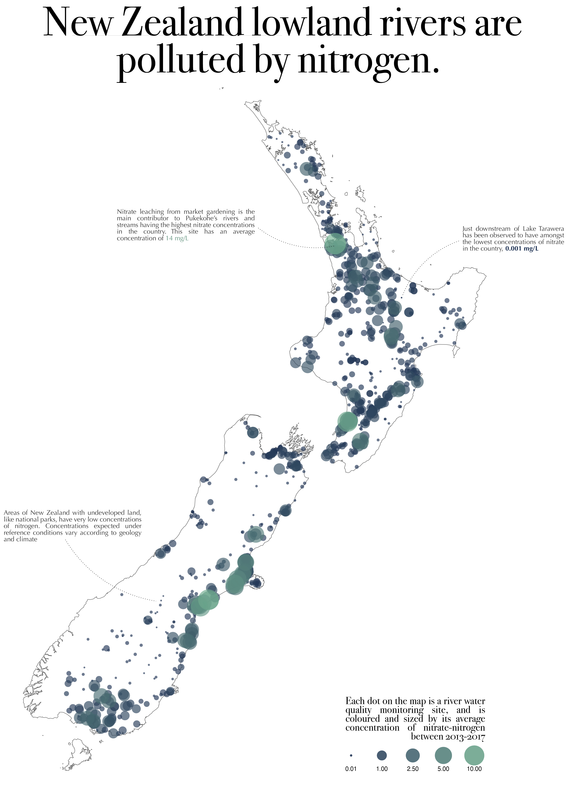
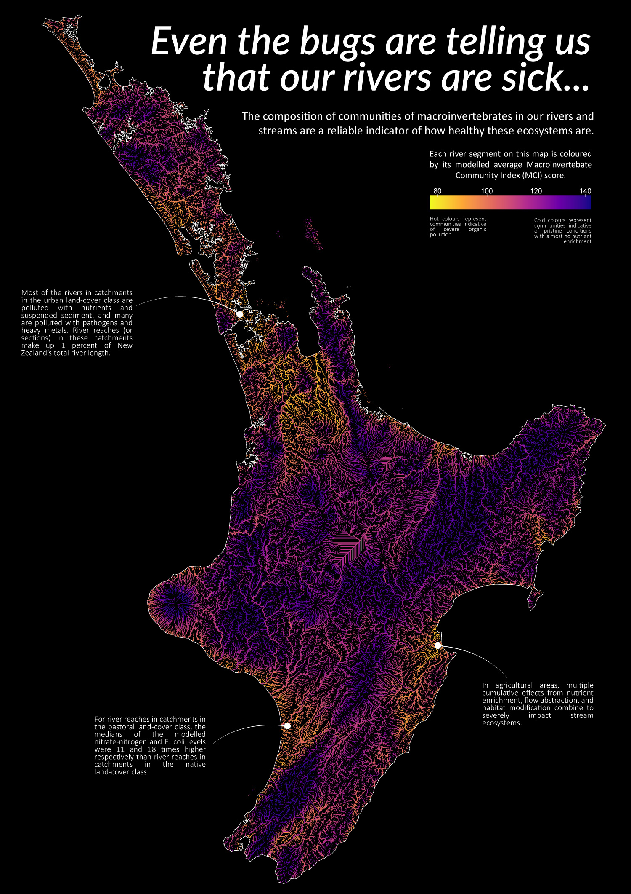

# 30 day map challenge - 2021

The map challenge is a daily mapping/cartography/data visualization challenge aimed at the spatial community. The idea is to create (and publish) maps based on different themes on each day of the month. There are no restrictions on the tools, technologies or the data you use in your maps.

Official repo: https://github.com/tjukanovt/30DayMapChallenge

## Day 1 - points

Here I map nitrogen pollution in New Zealand rivers, using a dataset of observations from Ministry for the Environment's environmental reporting team. Available at: https://data.mfe.govt.nz/table/99867-river-water-quality-state-20132017/. 

The colours in the colour scale were chosen by looking at the waterbodies with the best & worst nitrogen concentrations and getting an average RGB value from Sentinel-2 satellite imagery, then using a linear interpolation between the two colours to create a colour gradient. 

## Day 2 - lines

What better lines than river centrelines! This dataset incorporates random forest modelling to estimate MCI scores for every river segment in the country. Available at: https://data.mfe.govt.nz/table/99871-river-water-quality-modelled-state-20132017/

