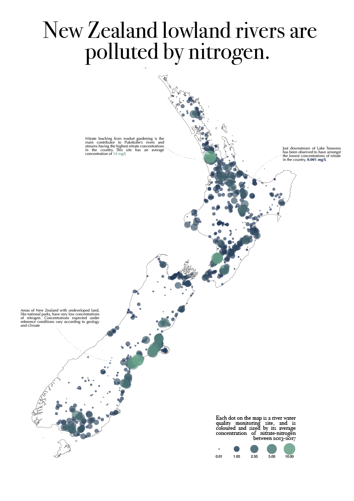

# 30 day map challenge - 2021

The map challenge is a daily mapping/cartography/data visualization challenge aimed at the spatial community. The idea is to create (and publish) maps based on different themes on each day of the month. There are no restrictions on the tools, technologies or the data you use in your maps.

Official repo: https://github.com/tjukanovt/30DayMapChallenge

## Day 1 - points

Here I map nitrogen pollution in New Zealand rivers, using a dataset of observations from Ministry for the Environment's environmental reporting team. 
Data available at: https://data.mfe.govt.nz/table/99867-river-water-quality-state-20132017/. 

The colours in the colour scale were chosen by looking at the waterbodies with the best & worst nitrogen concentrations and getting an average RGB value from Sentinel-2 satellite imagery, then using a linear interpolation between the two colours to create a colour gradient. 

## Day 2 - lines

What better lines than river centrelines! This dataset incorporates random forest modelling to estimate MCI scores for every river segment in the country. 
Data available at: https://data.mfe.govt.nz/table/99871-river-water-quality-modelled-state-20132017/

## Day 3 - polygons

I love small multiples maps, and I love marine reserves! Here I chopped out each marine reserve polygon on its own and arranged in a grid. 
Data available at: https://data.mfe.govt.nz/layer/52760-marine-reserves/

## Day 4 - hexagons

The Agricultural Production Survey collates some very useful farm-level statistics and aggregates them to a hex-grid for confidentality reasons. 
Data available at: https://data.mfe.govt.nz/layer/99906-livestock-numbers-grid-aps-2017/

## Day 5 - OpenStreetMap

Today's theme was OpenStreetMap (a collaborative project to create a free editable geographic database of the world). I've never worked with OpenStreetMap data before, and since the Our air 2021 report was recently released which shows air quality in terms of nitrogen dioxide is mostly impacted by traffic (especially heavy traffic) density... I thought I'd make a map showing how air quality monitoring sites related to streets (sourced from OSM). 
Data available at: https://data.mfe.govt.nz/table/106273-nitrogen-dioxide-concentrations-waka-kotahi-nzta-2007-2020/

